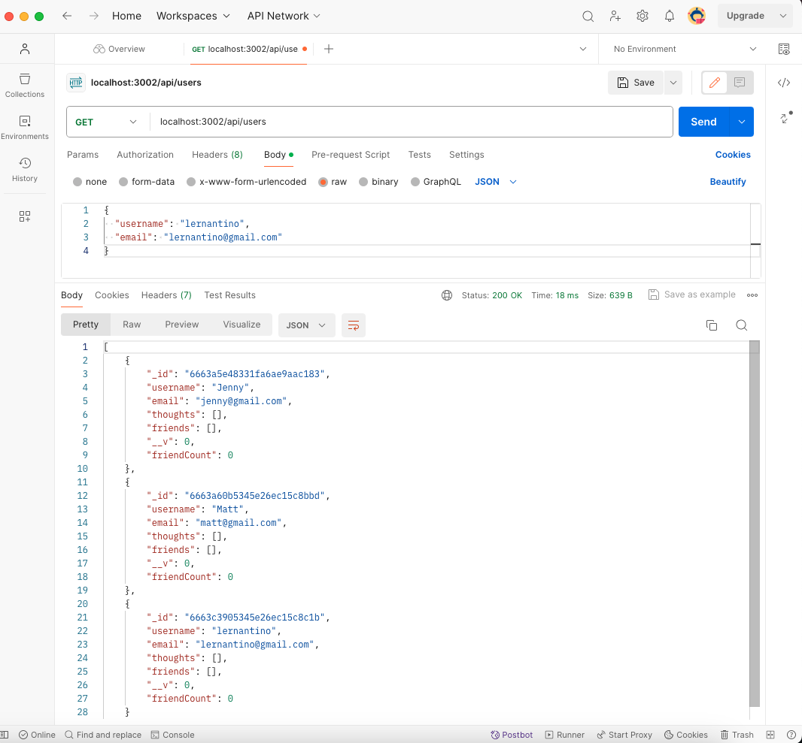
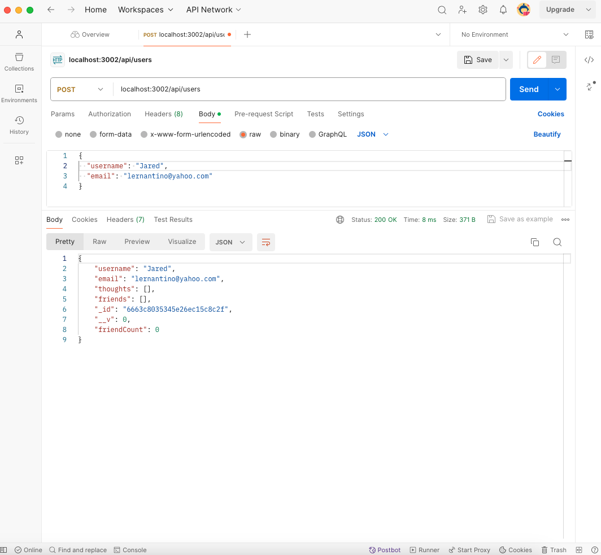
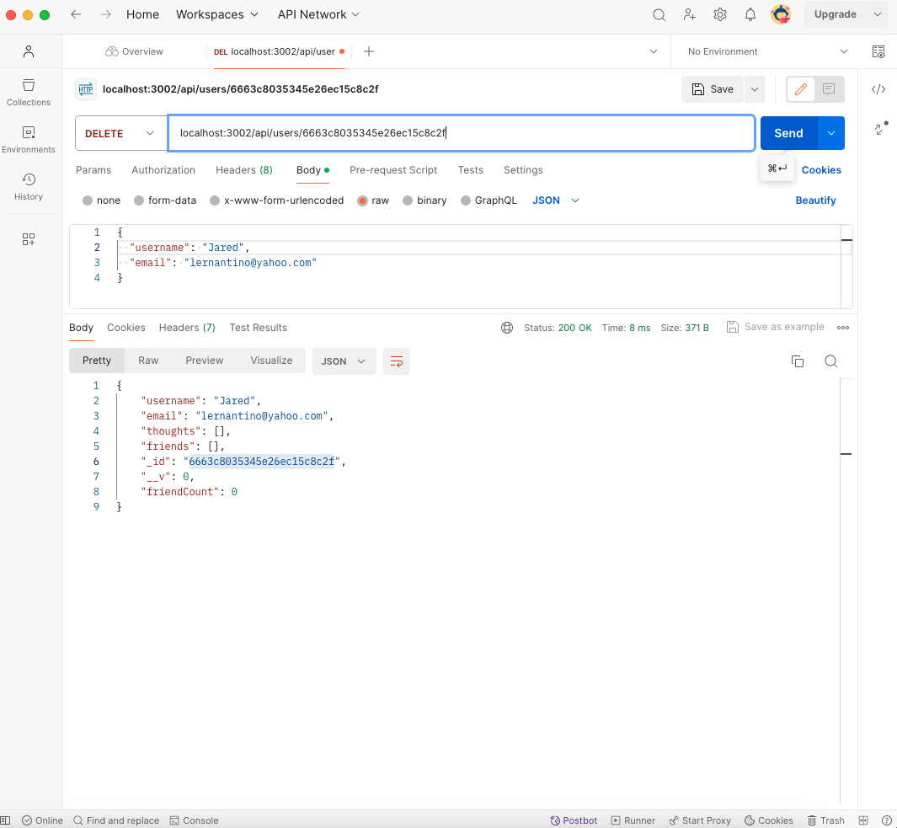
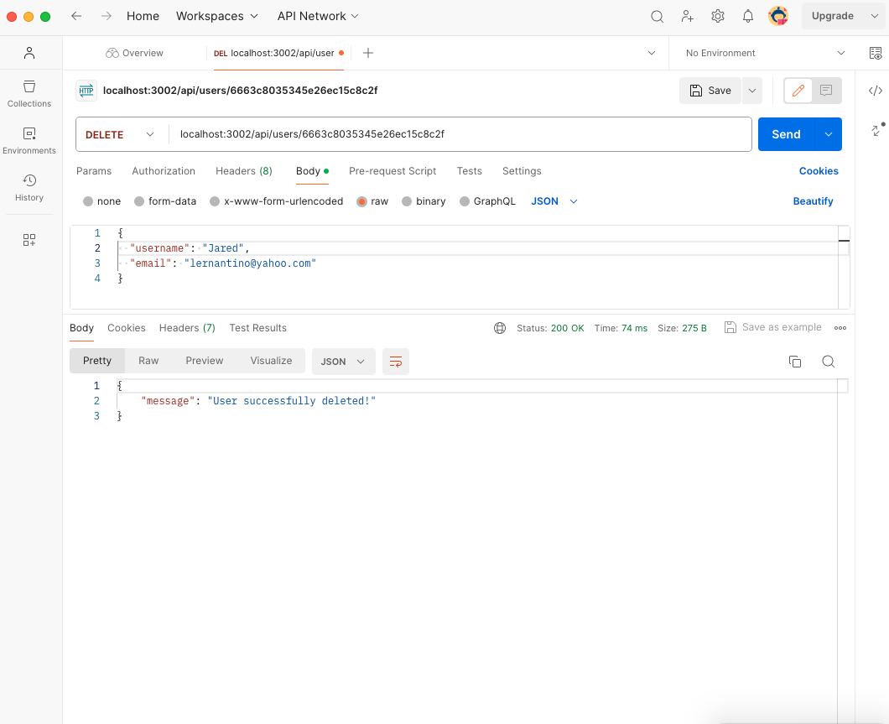
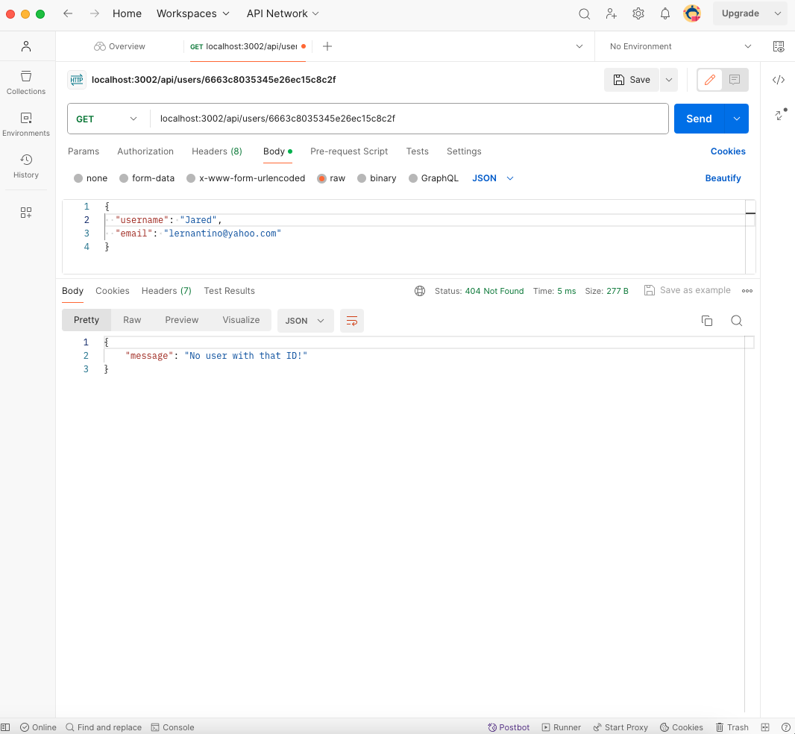
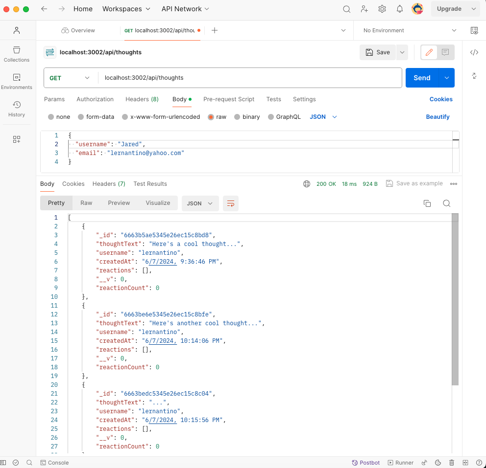
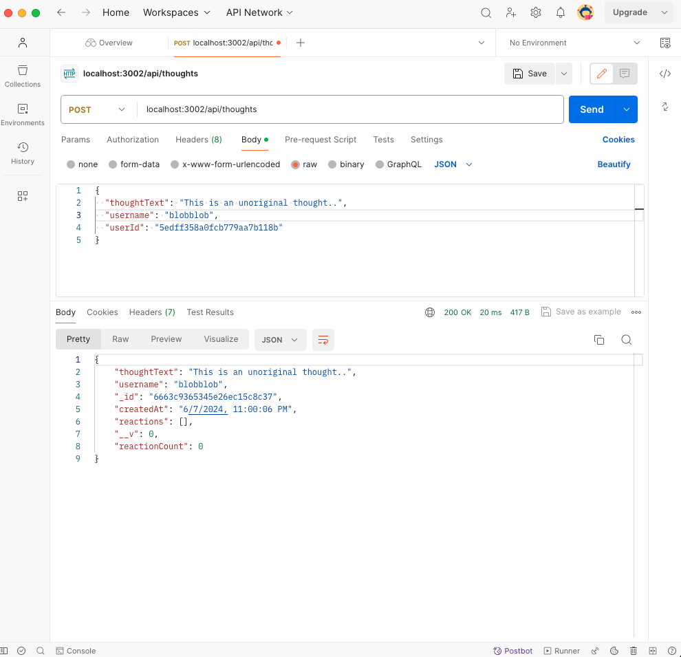
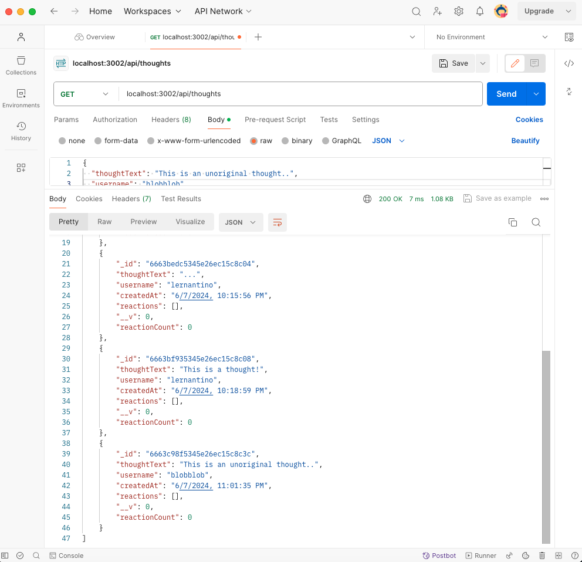
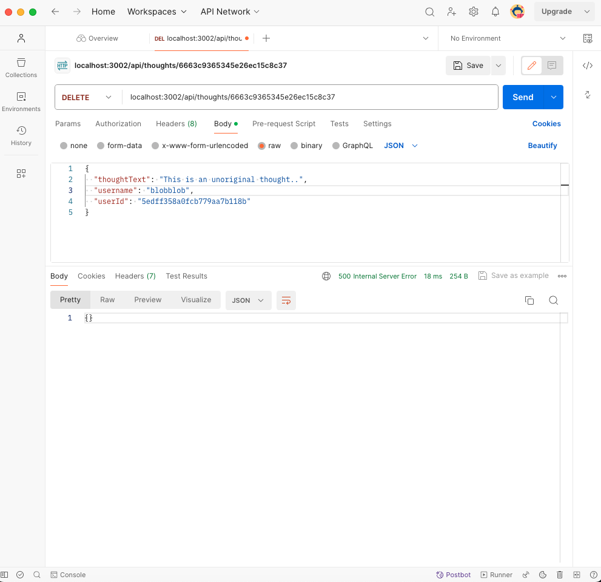

# friends-the-social-network-api
A social network API

## Table of Contents 
- [Description](#description)
- [Installation](#installation)
- [Usage](#usage)
- [Videos](#videos)
- [Screenshots](#screenshots)
- [License](#license)
- [Credits](#credits)

## Description
- A social network web application where users can share their thoughts, react to friend's thoughts and create a friend list. It utilizes Express.js for routing, a MongoDB database and Mongoose ODM. The seed data is created using Postman. Other technologies used includes JavaScript and Node.js.
- Challenges for this project mostly arose near the end. There were many small syntax issues, which were causing issues, similarly terminal issues that had to be resolved. Finally, there was terminal issue and connection error in Postman  that, for some reason, the server and mongoose would not connect simultaneously. To resolve this issue, code in server.js and connection.js was rewritten and the PORT was changed. 
- There were also many challenges with the PUT route in Postman. As well, and as with many challenges, time was an issue and having the desired amount of time to dedicate to the making of this project. 
- While making this project, a crucial rule I learned is that restful architecture states that resources and routes should be made plural in the index.js file.
- As of right now, general future development for this project would include creating a front-end. 

## Installation
- Clone this repository from GitHub to local environment
- Open the cloned repository in a source code editor, like Visual Studio Code
- Open the terminal and run the required packages by using the following commands:
• npm init
• npm i express
• npm i mongoose
• npm i nodemon
- Open Postman to create data and test the API routes

## Usage
- Utilize this API application in Postman to GET, POST, DELETE and PUT users and thoughts 

## Videos
- Videos showing usage of this project beginning with npm start command in terminal:
https://drive.google.com/file/d/1rXX4X8oeqCsgPj2026eyxBpFSn4Ifl3o/view

https://drive.google.com/file/d/1UAk5DTeuW_Ek_68h3C877P_j6MssY5Ia/view

## Screenshots
- Screenshots showing usage of this project: 

## License
- There is no license for this project.

## Credits
Blog. (2023, September 5). Mastering Email Validation in Mongoose: Syntax, Uniqueness, and Beyond. Bounceless. https://blog.bounceless.io/mastering-email-validation-in-mongoose-syntax-uniqueness-and-beyond/

Calle, T. (2023). Thomas NoSQl Social Network API. GitHub [Source Code]. https://github.com/ThomasCalle/Thomas-NoSQL-Social-Network-API.git

Li, S. (2022). Social Network API. GitHub [Source Code]. https://github.com/siennameow/social-network-API/blob/main/models/User.js

Mongoose. (2024). Mongoose (v8.3.3) Validation. Moongoose. https://mongoosejs.com/docs/validation.html

Tiglao, J. (2022). Social Media API. GitHub [Source Code]. https://github.com/jbtiglao/social-media-API/blob/main/models/User.js

University of Toronto. (2023). Coding Boot Camp [Source Code].

Weaver, I. [Issac S. Weaver] (2020, March 25). Mongoose: Validate Email Syntax [Online forum post]. Stack Overflow. https://stackoverflow.com/questions/18022365/mongoose-validate-email-syntax

